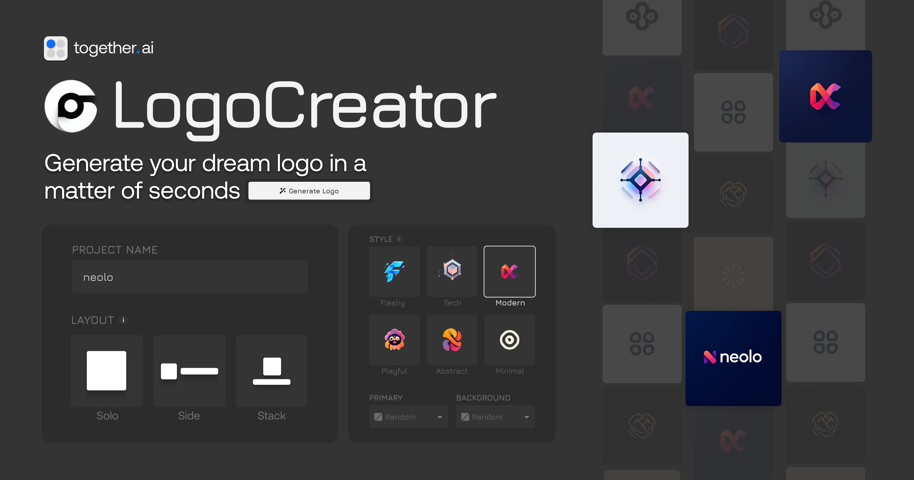

<a href="https://www.aigenlogo.io">
  
  <h1 align="center">AI Logo Generator</h1>
</a>

  An open source logo generator – create professional logos in seconds with customizable styles.

## Tech stack

- [Flux Pro 1.1](https://api.together.ai/signin?redirectUrl=/playground/image/black-forest-labs/FLUX.1.1-pro) on [Together AI](https://www.together.ai/) for logo generation
- [Next.js](https://nextjs.org/) with TypeScript for the app framework
- [Shadcn](https://ui.shadcn.com/) for UI components & [Tailwind](https://tailwindcss.com/) for styling
- [Upstash Redis](https://upstash.com/) for rate limiting
- [Clerk](https://clerk.com/) for authentication
- [Plausible](https://plausible.io/) & [Helicone](https://helicone.ai/) for analytics & observability

## Cloning & running

1. Clone the repo: `git clone https://github.com/Nutlope/logocreator`
2. Create a `.env` file and add your [Together AI API key](https://api.together.xyz/settings/api-keys): `TOGETHER_API_KEY=`
3. Run `npm install` and `npm run dev` to install dependencies and run locally.

## Current tasks

- [ ] Fully test locally on desktop, mobile, different browsers, and light/dark mode
- [ ] Fully test on prod, desktop + mobile
- [ ] When BYOK is set, set credits to "BYOK"
- [ ] Save BYOK to localstorage
- [ ] Play around with the prompt some more (read flux prompting best practices)

## Future Tasks

- [ ] Create a dashboard with a user's logo history
- [ ] Support SVG exports instead of just PNG
- [ ] Add support for additional styles
- [ ] Add a dropdown for image size (up to 1024x1024)
- [ ] Allow the ability to upload a reference logo (use vision model to read it)
- [ ] Redesign popular brand’s logos with my logo maker and have it in a showcase
